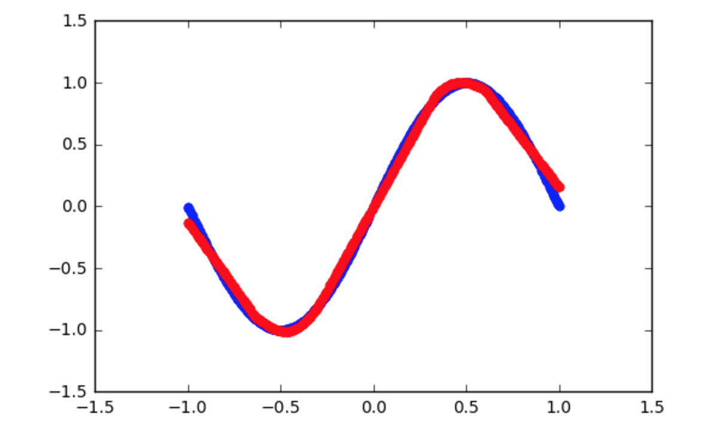
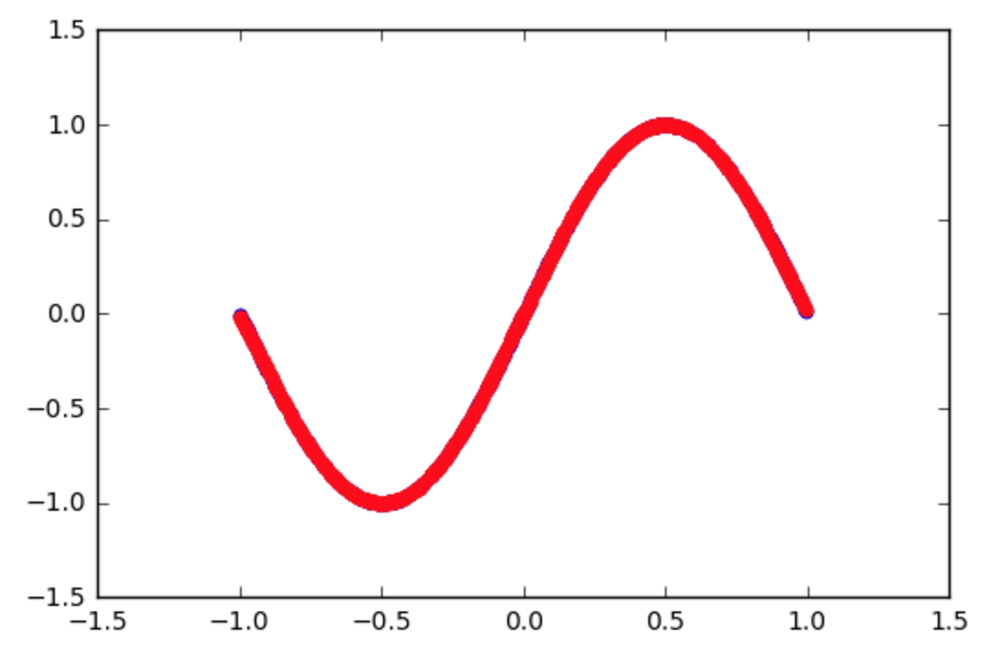

# 데이터 뻥튀기.

아직 아는게 없어서... 중근이형이 올려준 데이터 그냥 돌려보고...
어케 개선을 해야할지 몰라서 테스트 데이터만 10000 --> 1000000로 늘려보았습니다.

batch_size도 1000 --> 10000으로 늘렸는데...

솔직히 batch_size, epoch 개념을 잘 모르겠네요 ㅠ.ㅠ..

그래도 여튼 데이터를 늘리니 잘 나오는 것 같기는 합니다....

10000개 였을 때

10^6개 였을 때 (batch_size --> 10배로 늘렸을 때)

